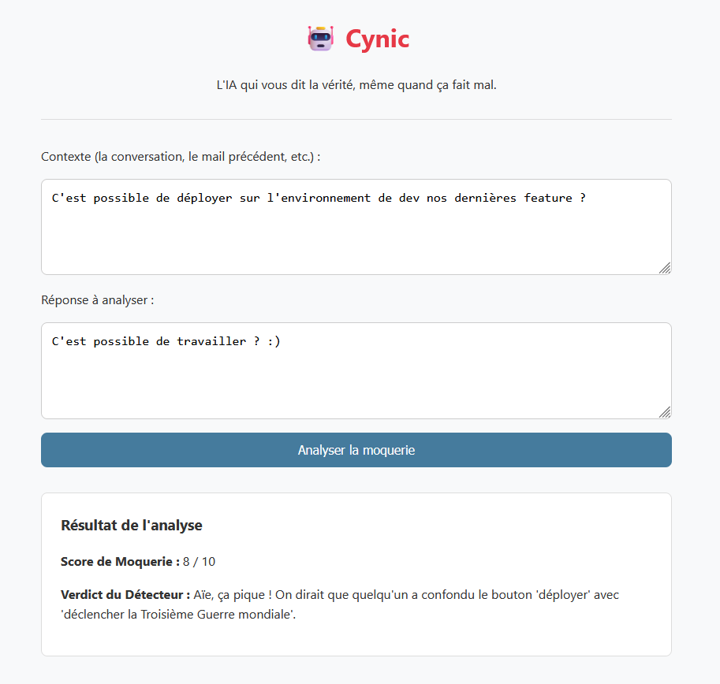

# 🤖 Cynic - Le Détecteur de Moquerie

**L'IA qui vous dit la vérité, même quand ça fait mal.**

[](https://github.com/RubenVP2/cynic/actions/workflows/ci.yml)


Fatigué du jargon corporate et des messages passifs-agressifs ? Cynic est un outil basé sur l'IA de Mistral qui analyse le texte pour révéler le niveau de cynisme et de moquerie.

Disponible en **ligne de commande (CLI)** ou via une **interface web** simple et épurée.



### ✨ Fonctionnalités

* **Analyse Fine :** Utilise les modèles de Mistral pour une compréhension nuancée du langage.
* **Score et Verdict :** Obtenez un score de cynisme sur 10 et un verdict clair de l'IA.
* **Double Interface :**
    * Un **outil CLI** robuste pour les habitués du terminal.
    * Une **interface web** accessible à tous, avec mode sombre.
* **API REST :** Un endpoint `/api/analyze` pour intégrer Cynic dans d'autres projets.
* **Documentation d'API :** Documentation interactive et automatique fournie par FastAPI.

---

### 🚀 Installation

Le projet utilise `pyproject.toml` pour gérer ses dépendances.

1.  **Clonez le projet :**
    ```bash
    git clone https://github.com/RubenVP2/cynic.git && cd cynic
    ```

2.  **Installez les dépendances :**
    * Pour utiliser **uniquement l'outil en ligne de commande** :
        ```bash
        pip install .
        ```
    * Pour **développer, tester ET lancer l'application web** :
        ```bash
        pip install -e ".[dev,web]"
        ```

---

### 🛠️ Utilisation

#### 1. Outil en Ligne de Commande (CLI)

Assurez-vous que votre clé API Mistral est disponible en tant que variable d'environnement :
```bash
export MISTRAL_API_KEY="VOTRE_CLÉ_ICI"
```
Lancez simplement la commande cynic :
```bash
cynic
```

Le programme vous demandera de saisir le contexte et la réponse à analyser.

#### 2. Interface Web et API REST

1. Définissez votre clé API Mistral dans le fichier (voir ci-dessus).
2. Lancez l'application web :

   ```bash
   uvicorn cynic.web.main:app --reload
   ```
3. Accédez aux services :
   - **Interface Web :** Ouvrez votre navigateur à `http://localhost:8000`.
   - **Documentation de l'API :** Accédez à `http://localhost:8000/docs` pour explorer les endpoints disponibles.


### 🤝 Contribuer

Les contributions sont les bienvenues !  
Que ce soit pour améliorer le code, proposer de nouvelles fonctionnalités ou corriger des bugs.

1. Forkez le projet.
2. Créez une nouvelle branche (git checkout -b feature/nouvelle-idee-geniale).
3. Faites vos modifications.
4. Ouvrez une Pull Request.

Quelques idées pour contribuer :

- Améliorer le PROMPT_SYSTEME pour rendre l'IA encore plus fine ou plus drôle.
- Ajouter des options (choix du modèle Mistral, etc.).
- Corriger les bugs que vous pourriez trouver.

### 📜 Licence
Ce projet est distribué sous la Licence MIT. Voir le fichier LICENSE pour plus de détails. En gros, faites-en ce que vous voulez, mais ne venez pas vous plaindre si vous vous faites virer.

---

Disclaimer : Cet outil est à but humoristique et éducatif. Je ne peut être tenu responsable des claviers cassés, des démissions soudaines ou des conversations professionnelles devenues subitement très honnêtes.
